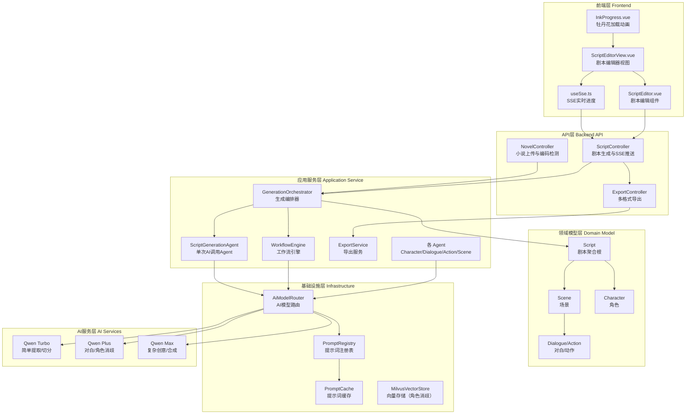
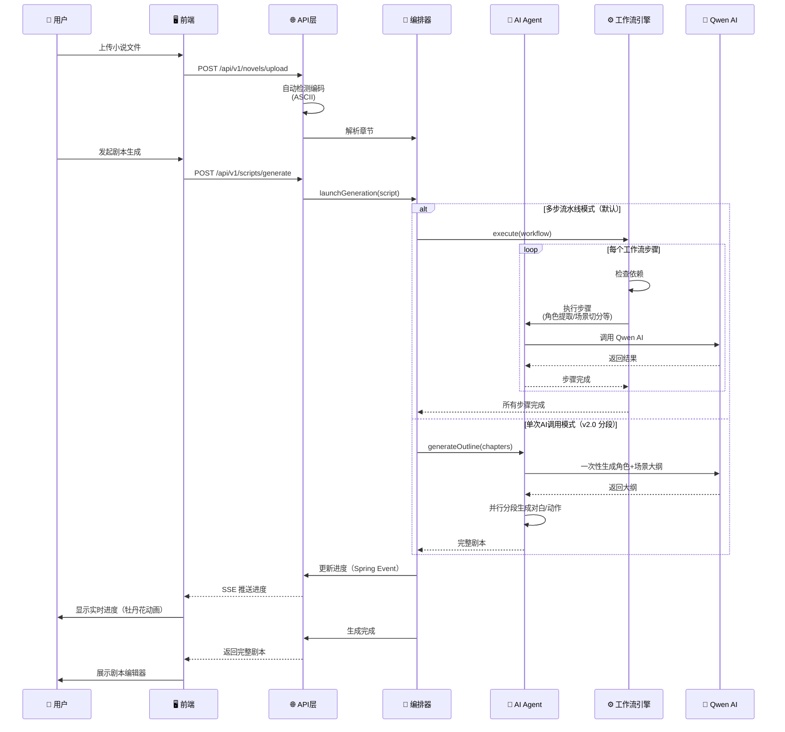

# Novel2Script — AI 驱动的小说转剧本系统

[](LICENSE)
[](https://adoptium.net/)
[](https://spring.io/projects/spring-boot)
[](https://vuejs.org/)
[](https://www.typescriptlang.org/)

> 🎬 **演示视频**：[GitHub Releases 下载 / 在线观看](https://github.com/Mr-123321/Novel2Script/releases/tag/v1.0.0)
>
> 夸克网盘地址https://pan.quark.cn/s/6e733d6fab63

Novel2Script YAML Schema 设计理由：Novel2Script文件夹下

---

## 技术栈

| 层级 | 技术 | 版本 |
|------|------|------|
| **语言** | Java | 17 |
| **后端框架** | Spring Boot | 3.5.0 |
| **AI 框架** | Spring AI | 1.0.0-M6 |
| **ORM** | MyBatis-Plus | 3.5.10 |
| **数据库** | MySQL | 8.0+ |
| **数据库迁移** | Flyway | 10.22.0 |
| **构建工具** | Maven | 3.6+ |
| **前端框架** | Vue 3 (Composition API) | 3.5 |
| **前端语言** | TypeScript | 6.0 |
| **前端构建工具** | Vite (Rolldown) | 8.0 |
| **状态管理** | Pinia | 3.0 |
| **路由** | Vue Router | 4.6 |
| **代码编辑器** | Monaco Editor | 0.55 |
| **AI 模型** | 通义千问 (Qwen) 多层级路由 + DeepSeek / OpenAI / Claude 可选 | - |
| **实时通信** | SSE (Server-Sent Events) | - |
| **YAML 处理** | SnakeYAML | 2.3 |

---

## 部署流程

### 1. 环境要求

| 依赖 | 最低版本 | 说明 |
|------|----------|------|
| **JDK** | 17 | 推荐 Eclipse Temurin 或 Amazon Corretto |
| **Maven** | 3.6+ | 后端构建（项目自带 `mvnw` wrapper，无需手动安装） |
| **Node.js** | 22+ | 前端构建（推荐使用 nvm-windows / fnm 管理版本） |
| **MySQL** | 8.0+ | 数据库，需创建空库 `novel2script` |
| **Qwen API Key** | - | [阿里云百炼](https://bailian.console.aliyun.com/) 申请 |

### 2. 数据库初始化

```sql
-- 登录 MySQL 并创建数据库
CREATE DATABASE IF NOT EXISTS novel2script
  DEFAULT CHARACTER SET utf8mb4
  DEFAULT COLLATE utf8mb4_unicode_ci;
```

> Flyway 会在应用首次启动时自动执行所有迁移脚本（`V1` ~ `V6`），无需手动建表。

### 3. 后端配置

在 `backend/novel2script-api/src/main/resources/` 下创建 `application-dev.yml`（已被 `.gitignore` 排除，不会提交到 Git）：

```yaml
spring:
  datasource:
    url: jdbc:mysql://localhost:3306/novel2script?useUnicode=true&characterEncoding=UTF-8&serverTimezone=Asia/Shanghai&createDatabaseIfNotExist=true
    username: root
    password: 你的数据库密码

  ai:
    providers:
      qwen-turbo:
        api-key: 你的Qwen API Key
      qwen-plus:
        api-key: 你的Qwen API Key
      qwen-max:
        api-key: 你的Qwen API Key
```

也可通过环境变量配置（无需修改配置文件）：

| 环境变量 | 说明 | 默认值 |
|----------|------|--------|
| `QWEN_API_KEY` | 通义千问 API 密钥 | 空 |
| `LOG_LEVEL_APP` | 应用日志级别 | `DEBUG` |
| `LOG_LEVEL_AI` | AI 框架日志级别 | `DEBUG` |

### 4. 启动后端

```bash
# 进入后端目录
cd backend

# 编译并启动（开发环境，使用 dev profile）
./mvnw spring-boot:run -pl novel2script-api

# 或者先打包再运行
./mvnw clean package -DskipTests
java -jar novel2script-api/target/novel2script-api-1.0.0-SNAPSHOT.jar
```

后端默认运行在 `http://localhost:8080`。

### 5. 启动前端

```bash
# 进入前端目录
cd frontend-vue

# 安装依赖
npm install

# 启动开发服务器
npm run dev
```

前端开发服务器运行在 `http://localhost:3000`，API 请求自动代理到后端 `8080` 端口。

### 6. 打开浏览器

访问 **http://localhost:3000** 即可使用：
1. 上传小说文件（支持拖拽或点击上传）
2. 选择生成模式（单次 AI 调用 / 多步流水线）
3. 实时查看剧本生成进度
4. 在线编辑剧本（场景、角色、对白、动作）
5. 导出 YAML / TXT / Markdown 格式

### 7. 生产构建

```bash
# 前端构建
cd frontend-vue
npm run build          # 产物输出到 dist/

# 后端打包
cd backend
./mvnw clean package -DskipTests   # 产物在 novel2script-api/target/
```

生产环境部署时，将前端 `dist/` 目录的内容由 Nginx 托管，反代 `/api/v1` 到后端 `8080` 端口即可。

---

## 1. 高层摘要（TL;DR）

*   **影响范围：** 🟢 **高** - AI 驱动的小说转剧本系统，包含后端、前端、领域模型和工作流引擎
*   **核心变更：**
    *   ✨ 新增 **Spring Boot 3.5** 后端架构，基于 **通义千问（Qwen）** 多层级 AI 模型路由
    *   ✨ 新增 **Vue 3 + TypeScript** 前端，包含剧本编辑器、实时进度追踪、YAML 预览
    *   ✨ 实现 **单次 AI 调用**（v2.0 分段模式）和 **多步流水线** 两种剧本生成模式
    *   ✨ 新增 **SSE 实时进度推送** 和 **多格式导出**（YAML / TXT / Markdown）
    *   ✨ 新增 **工作流引擎**（WorkflowEngine）支持并行执行、依赖解析和容错重试
    *   ✨ 集成 **MyBatis-Plus + Flyway** 数据库持久化（MySQL，6 版迁移脚本）

---

## 2. 可视化概览（代码与逻辑映射）

### 2.1 系统架构全景图



### 2.2 剧本生成流程图



---

## 3. 详细变更分析

### 3.1 后端核心架构

#### 📦 **模块总览**

| 模块 | 职责 |
|------|------|
| `novel2script-api` | REST API 控制器、SSE 推送、全局异常处理 |
| `novel2script-application` | 业务编排、AI Agent、工作流引擎、导出服务 |
| `novel2script-domain` | 领域实体、DTO/VO、领域事件、提示词模型 |
| `novel2script-infrastructure` | AI 模型路由、提示词注册/缓存、向量存储、配置 |
| `novel2script-common` | 枚举、异常、常量 |

#### 📦 **API 层（novel2script-api）**

**关键文件：**
- `Novel2ScriptApplication.java` - Spring Boot 应用入口
- `NovelController.java` - 小说上传和管理控制器
- `ScriptController.java` - 剧本生成和管理控制器
- `ExportController.java` - 多格式导出控制器（YAML / TXT / Markdown）
- `SseEmitterUtils.java` - SSE 工具类
- `SseEmitterRegistry.java` - SSE 连接注册表
- `SseJsonConverter.java` - SSE JSON 转换器
- `SseProgressListener.java` - SSE 进度事件监听器

**关键功能：**

| 功能 | 实现方式 | 说明 |
|------|----------|------|
| **编码自动检测** | `decodeWithDetection()` 方法 | 支持 ASCII 自动检测，包含双重编码修复逻辑 |
| **SSE 实时推送** | Spring Event + `SseEmitter` | `ScriptProgressChangedEvent` 驱动，进度变化时自动推送 |
| **多格式导出** | `ExportController` + `ExportService` | 支持 YAML、TXT、Markdown 三种格式的在线查看和下载 |

#### 📦 **应用服务层（novel2script-application）**

**关键文件：**
- `GenerationOrchestrator.java` - 生成编排器（核心入口）
- `ScriptGenerationAgent.java` - 单次 AI 调用 Agent（v2.0 分段模式）
- `WorkflowEngine.java` - 工作流引擎
- `WorkflowStateManager.java` - 工作流状态管理
- `WorkflowDefinitions.java` - 工作流步骤定义
- `ExportService.java` - 导出服务
- 多个 Agent：`CharacterAgent`、`DialogueAgent`、`ActionAgent`、`SceneAgent`、`ScriptComposer`、`CharacterResolverAgent`

**关键功能：**

| 组件 | 功能 | 技术亮点 |
|------|------|----------|
| **GenerationOrchestrator** | 编排整个生成流程 | 支持单次调用和多步流水线，自动回退，支持并行度配置 |
| **ScriptGenerationAgent** | v2.0 单次 AI 调用 | 先生成角色+场景大纲，再并行填充对白/动作 |
| **WorkflowEngine** | 工作流执行引擎 | 并行执行、依赖解析、重试机制、断点续传 |
| **SceneAgent** | 场景切分 | 并行逐章切分（MAX_PARALLEL=5），PromptCache 缓存 |
| **ExportService** | 多格式导出 | SnakeYAML + 自定义 Representer + Schema 验证 |

#### 📦 **基础设施层（novel2script-infrastructure）**

**关键文件：**
- `AiModelRouter.java` - AI 模型路由器（根据 TaskType 选择模型）
- `PromptRegistry.java` - 提示词注册表（从 classpath 加载 YAML 模板）
- `PromptCache.java` - Caffeine 缓存（MD5 key，TTL 120 分钟）
- `MilvusVectorStore.java` - 向量存储（角色消歧 Layer 2）
- `EmbeddingService.java` - 嵌入服务
- `SpringAiConfig.java` - Spring AI 多模型配置
- `MultiModelProperties.java` - 多模型配置属性

**AI 配置（application.yml）：**

| 配置项 | 默认值 | 说明 |
|--------|--------|------|
| `ai.default-provider` | qwen | 默认 AI 提供商 |
| `script.generation.single-pass.enabled` | false | 是否启用单次 AI 调用（默认走多步流水线） |
| `script.generation.single-pass.staged` | true | v2.0 分段模式 |
| `script.generation.single-pass.max-tokens` | 16384 | 单次调用最大 tokens |
| `script.generation.single-pass.chapter-truncate-chars` | 2000 | 章节内容截断长度 |

**AI 模型路由策略：**

| 模型 | 适合任务 | max-tokens | temperature |
|------|----------|------------|-------------|
| **qwen-turbo** | 章节解析、角色提取、场景切分、动作生成、YAML 导出 | 4096 | 0.3 |
| **qwen-plus** | 剧本合成、角色消歧、情节提取、对白生成 | 4096 | 0.7 |
| **qwen-max** | 复杂创意任务（按需启用） | 4096 | 0.7 |

**数据库（MyBatis-Plus + Flyway）：**

| 迁移版本 | 说明 |
|----------|------|
| V1 | 初始 Schema（novels, chapters, scripts, characters, scenes, dialogues, actions） |
| V2 | 审计表（prompt_audits, workflow_executions） |
| V3 | 索引优化 |
| V4 | 外键约束修复 |
| V5 | MyBatis-Plus 兼容性修复 |
| V6 | JSON 列默认值修复 |

#### 📦 **领域模型层（novel2script-domain）**

**关键实体：**

| 实体 | 核心字段 | 说明 |
|------|----------|------|
| **Script** | id, novelId, title, status, progress, workflowState | 剧本聚合根，包含工作流状态 |
| **Scene** | sceneNumber, location, timeOfDay, isInterior, summary | 场景，包含对白和动作序列 |
| **Character** | canonicalName, aliases, roleType, personality, relationships | 角色，包含关系网络 |
| **Dialogue** | speaker, content, emotion, sequenceOrder | 对白 |
| **Action** | description, type, sequenceOrder | 动作 |

### 3.2 前端核心架构

#### 📦 **视图组件（views/）**

| 文件 | 功能 |
|------|------|
| `HomeView.vue` | 首页：上传入口 + 功能卡片 + 最近剧本侧边栏（支持删除） |
| `ScriptEditorView.vue` | 剧本编辑主界面：编辑器 + 进度覆盖层 + 失败横幅 |
| `ScriptListView.vue` | 剧本列表：状态筛选 + 删除确认弹窗 |
| `CharacterManagerView.vue` | 角色管理：角色列表 + 角色编辑 |
| `ConfigView.vue` | 配置视图 |
| `YamlPreviewView.vue` | YAML 预览页面 |

#### 📦 **业务组件（components/）**

| 文件 | 功能 |
|------|------|
| `InkProgress.vue` | 牡丹花加载动画（8 瓣持续呼吸 + 文案切换） |
| `InkTopBar.vue` | 顶部导航栏 |
| `ScriptEditor.vue` | 剧本编辑器核心：场景列表 + 删除按钮 + 格式切换 |
| `SceneCard.vue` / `SceneList.vue` | 场景卡片与列表 |
| `DialogueBlock.vue` / `ActionBlock.vue` | 对白/动作编辑块 |
| `CharacterPanel.vue` | 角色信息面板 |
| `InsertFormPanel.vue` / `InsertBetweenButton.vue` | 场景间插入功能 |
| `WorkflowProgress.vue` | 工作流步骤进度展示 |
| `MermaidWorkflow.vue` | 工作流 Mermaid 图渲染 |
| `UploadZone.vue` | 小说上传区域（拖拽 + 点击 + SVG 云图标） |
| `CharacterCard.vue` / `CharacterEditor.vue` | 角色卡片与编辑器 |
| `RelationshipGraph.vue` | 角色关系图 |
| `MonacoEditor.vue` | Monaco 代码编辑器封装 |
| `ToastContainer.vue` | Toast 通知容器 |

#### 📦 **组合式函数与工具**

| 文件 | 功能 |
|------|------|
| `composables/useSse.ts` | SSE 连接管理：自动连接/断开、事件回调 |
| `lib/api.ts` | API 调用封装 |
| `lib/utils.ts` | 工具函数 |
| `stores/script.ts` | 剧本 Pinia 状态管理 |
| `stores/toast.ts` | Toast 通知状态管理 |
| `types/*.ts` | TypeScript 类型定义 |

### 3.3 导出功能

#### 📦 **多格式导出**

**支持格式：**

| 格式 | 端点 | 说明 |
|------|------|------|
| **YAML** | `GET /api/v1/exports/{id}/yaml` | 结构化剧本，可在线预览或下载 |
| **TXT** | `GET /api/v1/exports/{id}/txt/download` | 纯文本剧本 |
| **Markdown** | `GET /api/v1/exports/{id}/md/download` | Markdown 格式剧本 |

**YAML 输出示例：**
```yaml
script:
  id: 2
  novelId: 2
  title: "仙逆前三章"
  status: "COMPLETED"
  version: 1
  sceneCount: 8
  characterCount: 6
  dialogueCount: 64

  characters:
    - id: 2000
      canonicalName: "王铁柱"
      roleType: "PROTAGONIST"
      gender: "MALE"
      description: "山村孤儿，天生神力，被村民抚养长大，怀揣修仙梦想进入恒岳派；虽为杂灵根遭轻视，但力量与心性远超常人"
      personality:
        - "坚毅"
        - "感恩"
        - "隐忍"
        - "责任感强"
        - "质朴而自信"
      relationships:
        - target: "王大富"
          relation: "养父/恩人"
        - target: "李二丫"
          relation: "青梅竹马/同村伙伴"
        - target: "孙云鹤"
          relation: "入门考核执事/初步认可者"
        - target: "赵无极"
          relation: "竞争对手/对立者"
        - target: "刘大山"
          relation: "同门师兄弟/初期盟友"
```

**导出相关类：**
- `YamlExporter.java` - YAML 导出器（SnakeYAML，自定义 Representer）
- `ScriptYamlModel.java` - YAML 序列化模型
- `SchemaValidator.java` - 基于代码的 Schema 验证
- `ExportOptions.java` - 导出选项配置

---

## 4. 影响与风险评估

### ⚠️ **破坏性变更**

| 变更类型 | 影响范围 | 说明 |
|----------|----------|------|
| **无破坏性变更** | N/A | 这是一个全新项目初始化，所有文件均为新增 |

### 🧪 **测试建议**

#### **后端测试：**
1. **编码检测测试：**
   - 测试 ASCII 编码文件上传
   - 测试双重编码文件的修复逻辑
   - 测试非中文文件的错误处理

2. **剧本生成测试：**
   - 测试多步流水线模式（默认路径）
   - 测试单次 AI 调用 v2.0 分段模式
   - 测试 AI 失败后的回退机制
   - 测试部分结果恢复

3. **SSE 推送测试：**
   - 测试进度实时推送
   - 测试客户端断开重连
   - 测试 `ScriptProgressChangedEvent` 事件驱动链路

4. **导出测试：**
   - 测试 YAML / TXT / Markdown 三种格式导出
   - 测试 Schema 验证
   - 测试特殊字符处理

#### **前端测试：**
1. **进度显示测试：**
   - 测试牡丹花动画持续渲染
   - 测试生成失败时的错误横幅
   - 测试完成后的进度隐藏

2. **编辑器测试：**
   - 测试场景、对白、动作的 CRUD 操作
   - 测试格式切换
   - 测试删除剧本确认弹窗

3. **SSE 连接测试：**
   - 测试 `useSse` 自动连接和断开
   - 测试网络中断恢复
   - 测试多标签页并发

### 🔒 **安全考虑**

| 风险点 | 缓解措施 |
|--------|----------|
| **文件上传** | 限制文件大小（50MB）、检测编码、验证内容 |
| **AI API 调用** | 使用环境变量 `${QWEN_API_KEY}` 存储 API Key、支持多模型路由 |
| **SSE 连接** | 设置超时、限制并发连接数 |
| **导出** | Schema 验证、防止恶意数据注入 |
| **数据库** | 使用参数化查询（MyBatis-Plus），Flyway 管理迁移 |

---

## 5. 技术亮点总结

✨ **Qwen 多层级模型路由：** 根据任务复杂度自动选择 qwen-turbo / qwen-plus / qwen-max，兼顾速度与质量

✨ **双重生成模式：** 多步流水线（默认，可控精细）和单次 AI v2.0 分段（快速），支持自动回退

✨ **分段生成（v2.0）：** 先生成角色+场景大纲，再并行填充对白/动作，减少 AI 调用次数

✨ **实时进度推送：** 基于 Spring Event + SSE 的实时进度推送，前端牡丹花持续动画

✨ **工作流引擎：** 支持并行执行、依赖解析、重试机制、断点续传

✨ **编码自动检测：** 智能检测中文文件编码（ASCII），支持双重编码修复

✨ **多格式导出：** 支持 YAML / TXT / Markdown 三种格式在线预览与下载

✨ **PromptCache 缓存：** 基于 Caffeine + MD5 的提示词缓存，减少重复 AI 调用

✨ **容错机制：** AI 失败后自动回退到多步流水线，支持部分结果保存和恢复

✨ **中文 JSON 兼容：** 自动识别并转换 AI 返回的中文 JSON 键名（如 角色列表→characters）
